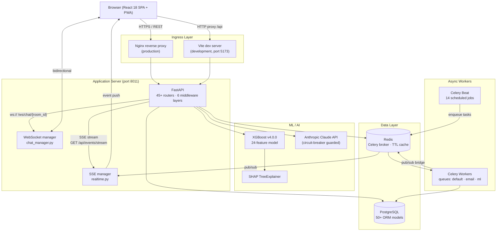
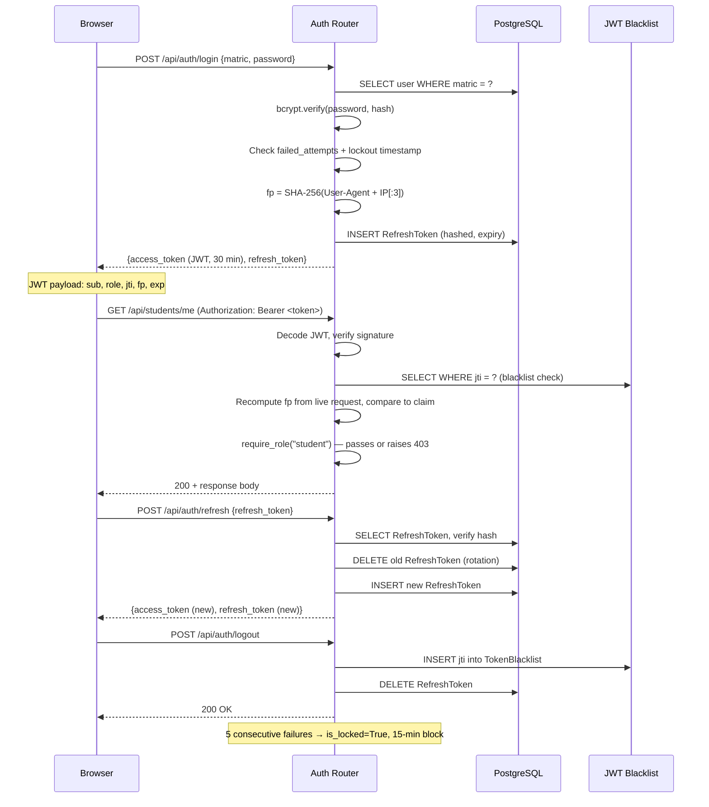
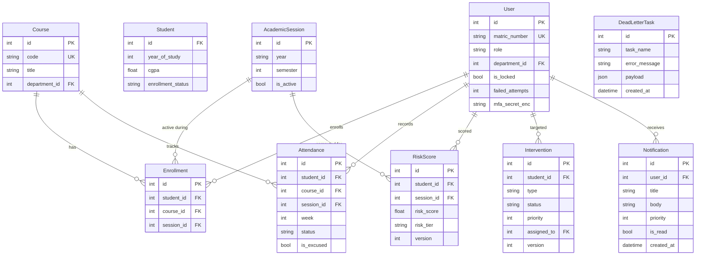
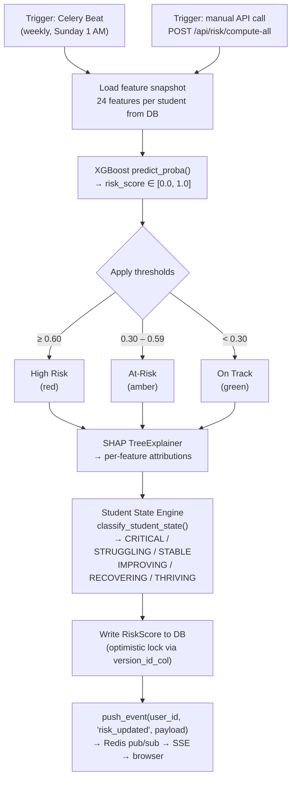
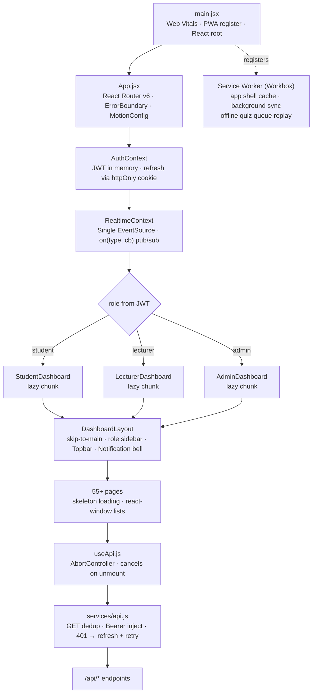

# Architecture — Maranatha University Academic Risk Detection System

This document describes the system's structure, data flows, and design decisions at a level of
detail that should let a new engineer navigate the codebase without needing to read every file.
It is kept in sync with the codebase manually; treat code as the ground truth if anything
conflicts.

---

## 1. System Overview

The system is a three-tier web application: a React SPA (frontend), a FastAPI service (backend),
and PostgreSQL as the primary store. Redis serves two independent roles — task queue broker for
Celery and fallback for an in-process TTL cache. Real-time updates travel from the backend to the
browser over Server-Sent Events; chat is bidirectional over WebSocket. All AI features proxy
through the Anthropic Claude API, gated by a circuit breaker.

---

## 2. Component Responsibilities

### Backend (`backend/`)

**`main.py`**
FastAPI application factory. Registers 45+ routers, each mounted at a distinct `/api/` prefix.
Applies six middleware layers in a defined order (see Section 9). Runs startup validation that
warns when VAPID keys are absent and initialises the ML model.

**`app_models.py`**
Defines 50+ SQLAlchemy ORM classes mapped to PostgreSQL tables. All models use `declarative_base`.
Two models — `RiskScore` and `Intervention` — carry a `version` column for optimistic locking via
SQLAlchemy's `version_id_col`, preventing lost-update races when multiple Celery workers write
concurrently.

**`app_schemas.py`**
Pydantic v2 schemas for every request body and response envelope. String fields use
`Field(max_length=…)` to enforce input size at the serialisation layer, before any DB query runs.
Response schemas are kept separate from ORM models so the API surface can evolve independently.

**`security.py`**
JWT lifecycle: `create_access_token()` embeds the user's role, a JTI (UUID), and a fingerprint
claim `fp = SHA-256(User-Agent + first-three-IP-octets)`. `verify_token()` checks the JTI against
the blacklist table and re-computes the fingerprint from the live request; a mismatch is treated
as a stolen token. `require_role(*roles)` is a FastAPI dependency factory that gates any route
to an allowed role set. Passwords are hashed with bcrypt at cost factor 12.

**`crypto_utils.py`**
Fernet symmetric encryption (AES-128-CBC with HMAC-SHA256) keyed from `SECRET_KEY` via PBKDF2.
Used exclusively to encrypt MFA secrets before they are written to the database and to decrypt
them at verification time.

**`circuit_breaker.py`**
Thread-safe state machine with three states: `CLOSED` (normal), `OPEN` (failing fast), and
`HALF_OPEN` (testing recovery). Configured for the Anthropic API: three consecutive failures
open the breaker; after a cooldown window, one probe request is allowed. All nine AI functions in
`ai_service.py` pass through this breaker. Exponential backoff is applied on retries before the
breaker trips.

**`pagination.py`**
Single `paginate(query, skip, limit)` helper. Hard-caps `limit` at 500 rows regardless of what
the caller requests. Returns `{items, total, skip, limit, has_more}` so clients can implement
cursor-style paging without re-counting.

**`celery_app.py`**
Configures the Celery application with Redis as broker and result backend. Declares the 14 Beat
schedule entries (see Section 8). Routes tasks across three queues: `default`, `email`, and `ml`.

**`worker_tasks.py`**
Contains the actual task implementations called by Beat or triggered ad hoc:
- Token blacklist cleanup (prunes rows older than token TTL)
- Full-cohort risk recomputation (batches students, calls `ml_service.py`)
- SOS escalation check (finds unresponded SOS alerts, re-notifies)
- Feature drift detection (compares live feature distribution to training baseline)
- Model retraining trigger (hands off to `ml_service.py` when drift exceeds threshold)

**`session_utils.py`**
Academic session awareness isolated in one place. `get_active_or_latest_session(db)` returns the
current `AcademicSession` row, falling back to the most recent completed session when none is
active. `compute_current_week()` derives the ISO week number relative to session start, with
holiday awareness so that holiday weeks do not advance the counter.

**`cache.py`**
Thread-safe in-process dictionary with per-key TTL. On a cache miss, falls back to Redis so that
results survive a process restart. Used for frequently read, rarely changed data such as
`SystemSetting` values and the active session record.

**`ml_service.py`**
Loads the XGBoost model artifact from disk at startup. Exposes `predict_risk(features: dict)`
which assembles the 24-feature vector, calls `predict_proba()`, and returns the raw probability.
Instantiates a `shap.TreeExplainer` once at module load and caches it; `explain(features)` returns
per-feature SHAP values used to generate the Next Best Action recommendations.

**`ai_service.py`**
Nine Claude API functions: AI tutor dialogue, quiz generation, intervention recommendation,
weekly narrative, post-quiz recovery plan, proactive check-in, weekly data letter, admin digest,
and course material analysis. Each function constructs a system prompt and a context window (up
to 40k characters for the tutor path), calls the circuit breaker, and returns structured text.
A `_adapt_prompt_for_tone()` helper adjusts phrasing based on the student's stored tone preference
(`encouraging` / `neutral` / `minimal`).

**`realtime.py`**
Two public functions: `push_event(user_id, event_type, payload)` and
`push_event_to_many(user_ids, event_type, payload)`. Writes a `RealtimeEvent` row to PostgreSQL,
then publishes to the Redis channel that the SSE manager subscribes to. This means workers running
in a separate process can reach browser clients without sharing memory.

---

### Frontend (`frontend/src/`)

**`App.jsx`**
React Router v6 root. Role-based dashboard chunks are loaded with `React.lazy` and wrapped in
`Suspense`. A top-level `ErrorBoundary` catches render errors and shows a fallback UI.
`MotionConfig` from Framer Motion sets the `reducedMotion` policy globally.

**`context/AuthContext.jsx`**
Stores the JWT and decoded claims in memory (not `localStorage`). Refresh token is kept in an
`httpOnly` cookie. Exposes `login()`, `logout()`, and `user` to consumers. On mount, verifies the
stored token is not expired before hydrating state.

**`context/RealtimeContext.jsx`**
Opens a single `EventSource` to `GET /api/events/stream` after login. Implements an internal
pub/sub registry: `on(eventType, callback)` registers a listener; the context dispatches incoming
SSE messages to all matching listeners. 23 pages subscribe to at least one event type. The
connection is torn down on logout.

**`context/NotificationContext.jsx`**
Wraps the browser Badging API (`navigator.setAppBadge`) and VAPID push subscription lifecycle.
Tracks unread notification count and updates the app badge accordingly.

**`hooks/useApi.js`**
Thin wrapper around `fetch` that creates an `AbortController` per call and cancels the in-flight
request when the calling component unmounts. Manages `loading`, `data`, and `error` state locally.

**`services/api.js`**
The sole HTTP client in the frontend. All 55+ pages import from here; `utils/api.js` was removed.
GET requests are deduplicated: if the same URL is already in flight, the second caller receives
the same Promise rather than issuing a second network request. Attaches the `Authorization` header
from `AuthContext` and handles 401 by triggering a token refresh before retrying once.

**`components/ui/`**
Shared design-system components. `Modal.jsx` implements full ARIA semantics: `role=dialog`,
`aria-modal`, `aria-labelledby`, focus trap that cycles Tab/Shift+Tab within the modal, and focus
restoration to the trigger element on close. `CustomDropdown` uses `role=listbox` with
`aria-activedescendant`.

**`pages/`**
55+ pages organised under `student/` (17+), `lecturer/` (14), `admin/` (15), and `public/` (6).
All use skeleton loading states on initial render. Long lists (chat messages, notification feeds)
use `react-window` virtualisation to avoid rendering off-screen DOM nodes.

---

## 3. Authentication Flow

---

## 4. Database Schema (Key Models)

`RiskScore.version` and `Intervention.version` are managed by SQLAlchemy's `version_id_col`.
Any `UPDATE` that sends a stale version number raises `StaleDataError`, which the application
catches and retries. This prevents two Celery workers from silently overwriting each other's
writes.

`DeadLetterTask` captures tasks that failed all retry attempts. An admin endpoint surfaces these
rows so failed background jobs can be inspected and replayed without trawling logs.

---

## 5. Risk Computation Pipeline

The 24-feature vector is constructed from a single batch query joining `Enrollment`,
`Attendance`, `QuizAttempt`, `AssignmentSubmission`, `EngagementMetric`, `StudentCheckin`, and
`LoginSession`. SGPA is the highest-importance feature (SHAP mean |value| = 0.521); 20 of 24
features carry non-zero importance.

The Student State Engine is applied after scoring. It does not change the numeric risk score; it
attaches a trajectory label based on the direction and magnitude of score movement over recent
sessions. A student moving from 0.72 → 0.45 over two weeks is `RECOVERING`, not `AT_RISK`,
even though they are still above the at-risk threshold. This distinction is surfaced in the
student dashboard and in intervention recommendations.

---

## 6. Real-time Architecture

The backend exposes one SSE endpoint and one WebSocket endpoint. These serve different purposes
and are intentionally kept separate.

**SSE (`GET /api/events/stream`)**
Each authenticated user opens one long-lived SSE connection after login. `RealtimeContext` in the
frontend manages this connection and reconnects on drop. The server sends events as standard
`data: <json>\n\n` frames. Event types include `risk_updated`, `new_notification`, `sos_alert`,
`intervention_created`, `chat_message`, `class_reminder`, and `deadline_reminder`.

Because Celery workers run in a separate process (sometimes on a separate machine), they cannot
push directly to SSE connections held by the API process. The bridge is Redis pub/sub:
`realtime.py` publishes to a per-user Redis channel, and the SSE manager subscribes to that
channel. When a message arrives, it is forwarded to the matching open `EventSource`.

23 pages subscribe to at least one event type. Each page calls `on(eventType, callback)` from
`RealtimeContext` in a `useEffect`, and deregisters on unmount. This avoids having 23 separate
HTTP polling loops.

**WebSocket (`ws:///ws/chat/{room_id}`)**
Bidirectional, used only for chat. `chat_manager.py` maintains an in-memory map of
`room_id → [connected WebSocket]`. When a message arrives from one client, it is broadcast to all
other members of the room. Chat messages are also persisted to `ChatMessage` in PostgreSQL
synchronously, so users who were offline can retrieve history via REST on reconnect.

---

## 7. Frontend Architecture

Code splitting is applied at the dashboard level and at heavy utility boundaries. The PDF export
libraries (jsPDF + html2canvas) are not included in the initial bundle; they load lazily when
the user first requests a report download. This reduced the initial load from approximately
2.8 MB to 195 KB (93% reduction).

All major pages display skeleton components while their `useApi` call is in flight. This is
preferred over a global spinner because it preserves layout stability and reduces cumulative
layout shift.

---

## 8. Scheduled Tasks (14 Celery Beat Jobs)

| # | Job Name | Schedule | Purpose |
|---|----------|----------|---------|
| 1 | `token-cleanup` | Daily 2:00 AM | Purges expired rows from `TokenBlacklist` and `RefreshToken` tables |
| 2 | `event-cleanup` | Daily 3:00 AM | Deletes `RealtimeEvent` rows older than the retention window |
| 3 | `deadline-reminders` | Daily 8:00 AM | Queries upcoming assignment deadlines, fires per-student notifications |
| 4 | `class-reminders` | 30 min before each class | Attendance nudge for students on the day's timetable |
| 5 | `risk-compute` | Weekly, Sunday 1:00 AM | Full-cohort risk recomputation via `ml_service.predict_risk()` |
| 6 | `sos-check` | Every 6 hours | Escalates SOS alerts that have received no staff response |
| 7 | `class-missed` | 2 h after class end | Marks unexplained absences for classes with no attendance record |
| 8 | `weekly-progress-email` | Monday 9:00 AM | Student progress digest email (console output in dev) |
| 9 | `intervention-escalation` | Daily 9:00 AM | Promotes pending interventions past SLA to higher priority |
| 10 | `consumed-event-cleanup` | Daily 4:00 AM | Purges `RealtimeEvent` rows already delivered and marked consumed |
| 11 | `engagement-compute` | Weekly | Recalculates composite engagement scores from raw activity signals |
| 12 | `checkin-reminder` | Daily 10:00 AM | Sends mental health check-in prompt to students who have not checked in |
| 13 | `proactive-tutor-checkin` | Weekly | AI tutor initiates contact with at-risk students who have been inactive |
| 14 | `admin-weekly-digest` | Monday 7:30 AM UTC | Summarises high-risk count, SOS alerts, and escalations for admin staff |

Jobs 1, 2, and 10 are housekeeping and are safe to run at any time. Jobs 5 and 11 are CPU-heavy
and are scheduled overnight to avoid contending with interactive requests. All tasks are routed
to the `ml` queue for jobs 5 and 11, and to `email` for jobs 3, 8, and 14, so workers can be
scaled independently.

---

## 9. Middleware Stack

Middleware is applied in the order listed below. The outermost layer (first in the list) receives
the request first and the response last.

| Order | Middleware | Purpose |
|-------|------------|---------|
| 1 | `CORSMiddleware` | Allows requests from configured frontend origins; rejects others at the protocol level |
| 2 | `SecurityHeadersMiddleware` | Injects `Content-Security-Policy`, `X-Frame-Options: DENY`, `Strict-Transport-Security`, `Referrer-Policy`, and `Permissions-Policy` on every response |
| 3 | `RequestLoggingMiddleware` | Emits a structured JSON log line per request: method, path, status code, duration in ms |
| 4 | `ExceptionHandlerMiddleware` | Catches any unhandled exception that escapes route handlers; returns a standardised `{detail, request_id}` JSON body with status 500 rather than exposing a traceback |
| 5 | `RequestTimeoutMiddleware` | Cancels any request that has not completed within 30 seconds; returns 504 |
| 6 | `RequestSizeLimitMiddleware` | Rejects request bodies exceeding the configured limit before the body is read into memory |

`ExceptionHandlerMiddleware` logs the full traceback internally while returning a sanitised
message to the client. This keeps stack traces out of API responses without silently discarding
error information.

---

## 10. Security Controls

**Token security**
- JWT (HS256) with 30-minute expiry. Each token carries a `jti` (UUID) that is checked against
  the `TokenBlacklist` table on every protected request. Logging out immediately invalidates the
  token server-side rather than waiting for expiry.
- Refresh tokens are stored as bcrypt hashes in `RefreshToken`. On use, the old record is deleted
  and a new one is created (rotation). A stolen refresh token can be used at most once before the
  legitimate user's next refresh invalidates it.

**Session binding**
- The JWT `fp` claim is `SHA-256(User-Agent + first-three-IP-octets)`. On every request, the
  middleware recomputes this value from the live headers and compares it to the claim. A mismatch
  (e.g., a token replayed from a different network or browser) returns 401. Using only the first
  three octets of the IP tolerates DHCP changes within the same network without breaking sessions.

**Credential security**
- Passwords hashed with bcrypt, cost factor 12.
- A blocklist of 200+ common passwords is checked at registration and password change.
- MFA secrets encrypted with Fernet (AES-128-CBC + HMAC-SHA256) before being written to the
  database. The encryption key is derived from `SECRET_KEY` via PBKDF2 with a fixed salt, so
  rotating `SECRET_KEY` invalidates all MFA secrets and forces re-enrolment.

**Input validation**
- Pydantic `Field(max_length=…)` on every string field in request schemas. Oversized inputs are
  rejected with 422 before any handler logic runs.
- `RequestSizeLimitMiddleware` rejects requests with excessively large bodies entirely.

**Rate limiting and lockout**
- `slowapi` rate limiting on `/api/auth/login` and `/api/auth/refresh`.
- Five consecutive failed login attempts lock the account for 15 minutes. The lockout timestamp
  and attempt counter are stored in `User` and reset on a successful login.

**Transport and browser security**
- `Strict-Transport-Security` header enforces HTTPS in browsers that have visited the site.
- `Content-Security-Policy` restricts script and style sources.
- `X-Frame-Options: DENY` prevents the app from being embedded in iframes.
- Push notifications are VAPID-signed; unsigned pushes are rejected by the browser.
