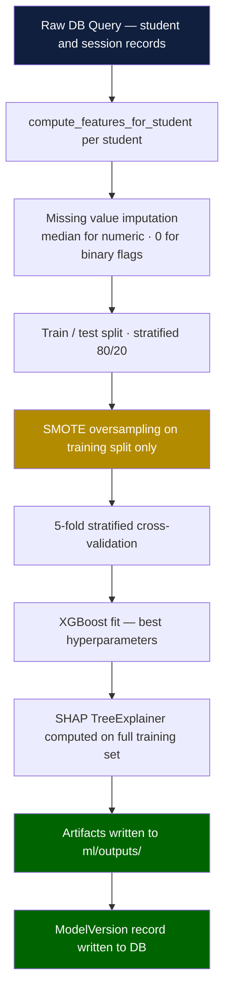
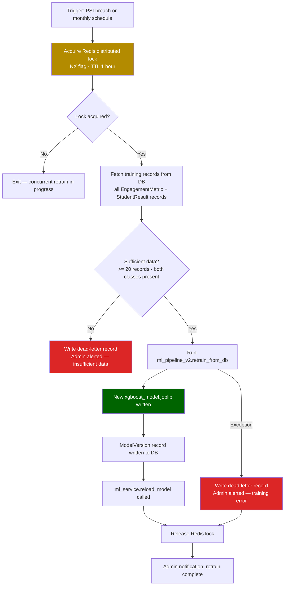
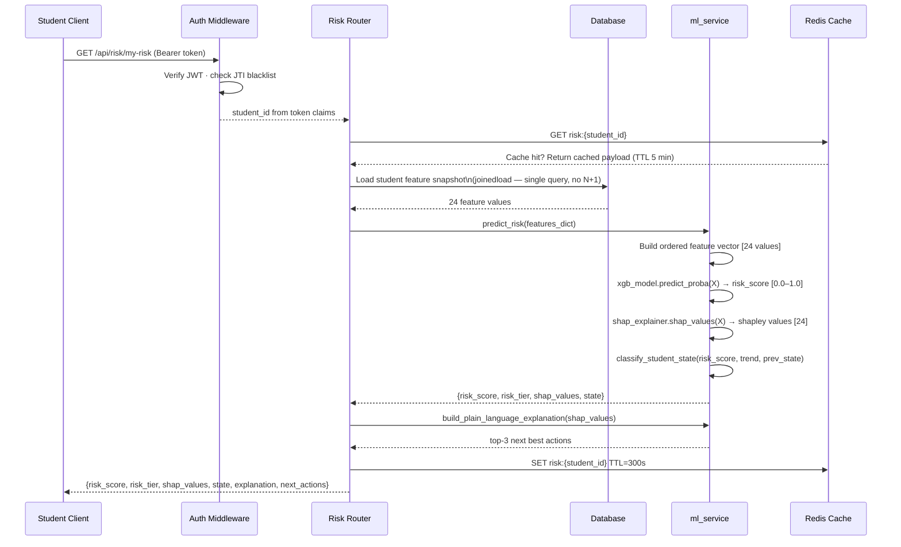

# Risk Engine — Technical Reference

**System:** Maranatha University Academic Risk Detection System
**Author:** Omeche Chimaobi Benedict (22/CSC/007), B.Sc. Computer Science
**Model Version:** 4.0.0
**Last Updated:** 2026-04-06

---

## Table of Contents

1. [Problem Statement](#1-problem-statement)
2. [Model Specification (v4.0.0)](#2-model-specification-v400)
3. [Feature Set (24 Features)](#3-feature-set-24-features)
4. [Training Pipeline](#4-training-pipeline)
5. [Risk Score Thresholds](#5-risk-score-thresholds)
6. [SHAP Explanations](#6-shap-explanations)
7. [Student State Engine](#7-student-state-engine)
8. [Model Drift Detection](#8-model-drift-detection)
9. [Automated Retraining](#9-automated-retraining)
10. [Inference Path (per request)](#10-inference-path-per-request)
11. [Limitations](#11-limitations)
12. [File Reference](#12-file-reference)

---

## 1. Problem Statement

### Classification Task

The engine frames academic risk as a **binary classification problem**: given a snapshot of a student's behavioural and academic signals at any point during the semester, predict whether that student is on a trajectory toward **Not-Graduate-Suitable (NGS)** status — i.e., failing to meet the minimum academic requirements for continued progression.

| Class | Symbol | Definition |
|-------|--------|------------|
| Graduate-Suitable | GS (label = 1) | Student is on track to pass the semester |
| Not-Graduate-Suitable | NGS (label = 0) | Student is at risk of academic failure |

The model outputs a continuous risk score in the range [0.0, 1.0], where higher values indicate greater probability of NGS status. This score is the primary signal consumed downstream by the threshold engine, the Student State Engine, and the SHAP explanation layer.

### Why Early Warning Matters

End-of-semester GPA is a lagging indicator: by the time a student's SGPA falls below threshold, the semester is over and the intervention window has closed. The Maranatha Risk Engine shifts detection upstream by monitoring **24 behavioural and academic signals** throughout the active semester. A student exhibiting declining attendance, missed assessments, and low digital engagement in week 4 is at meaningful risk weeks before any grade is recorded.

Early detection enables three distinct interventions, each tailored to a consumer role:

- **Students** receive plain-language advice derived from SHAP feature attribution — specific, actionable guidance tied to the behaviours driving their risk, rather than generic encouragement.
- **Lecturers** see intervention priority queues, flagging which students in their courses require contact and why.
- **Administrators** access cohort-level reports — risk distribution by department, level, and week — enabling resource allocation decisions across the institution.

The system deliberately avoids treating risk as a binary label visible to students. Instead, the score is translated into supportive language ("Needs Extra Support") and concrete next actions, reducing stigma while preserving the analytical precision required for institutional use.

---

## 2. Model Specification (v4.0.0)

| Property | Value |
|----------|-------|
| Model type | XGBoost binary classifier (XGBClassifier) |
| Version | 4.0.0 |
| Training records | 1,330 synthetic student-session snapshots |
| Input features | 24 behavioural and academic features |
| Target variable | is_graduate_suitable (0 = NGS, 1 = GS) |
| Overall accuracy | 0.997 |
| NGS F1 score | 0.980 |
| Top feature | SGPA — importance weight 0.521 |
| Non-zero feature importances | 20 of 24 |
| Imbalance handling | SMOTE (Synthetic Minority Over-sampling Technique) |
| Evaluation method | 5-fold stratified cross-validation |
| Primary artifact | ml/outputs/xgboost_model.joblib |

### Why XGBoost

XGBoost (eXtreme Gradient Boosting) is selected for four concrete reasons relevant to this problem:

1. **Tabular performance.** Gradient-boosted tree ensembles consistently outperform linear models and bagging ensembles on heterogeneous tabular data — a mix of rates, counts, ordinal values, and composite scores.
2. **Built-in regularisation.** `max_depth`, `min_child_weight`, and `scale_pos_weight` limit overfitting on 1,330 training records without requiring a separate regularisation pass.
3. **Class imbalance support.** `scale_pos_weight` adjusts the loss function to account for the GS/NGS class ratio, complementing SMOTE oversampling applied during training.
4. **SHAP compatibility.** `shap.TreeExplainer` computes exact Shapley values for XGBoost in polynomial time, enabling per-prediction explanations without approximation error from kernel methods.

---

## 3. Feature Set (24 Features)

Features are extracted per-student at inference time by `compute_features_for_student()` in `ml_service.py`, drawing from database records across the active academic session. They are grouped into five logical categories.

### 3.1 Academic Performance (5 features)

| Feature | Description | Range |
|---------|-------------|-------|
| `sgpa` | Semester Grade Point Average — latest recorded result | 0.00 – 5.00 |
| `cgpa` | Cumulative GPA across all completed semesters | 0.00 – 5.00 |
| `failed_courses_count` | Number of courses failed in current or most recent semester | 0 – N |
| `courses_outstanding` | Number of carry-over courses not yet cleared | 0 – N |
| `current_year` | Academic year level (100–400) as proxy for programme stage | 100, 200, 300, 400 |

Academic performance features carry the highest predictive weight — SGPA alone accounts for 0.521 of total XGBoost feature importance. This is expected: a student's GPA directly reflects cumulative academic standing and encodes the outcome of all prior engagement behaviours. CGPA extends the signal across semesters, capturing students who experienced difficulty in earlier years. Failed courses and outstanding carry-overs introduce a structural dimension: a student with three carry-overs faces a compounding workload that increases NGS probability regardless of current-semester engagement. `current_year` acts as a proxy for programme stage, reflecting that 100-level students face an adjustment period while 400-level students approaching graduation carry different risk profiles.

### 3.2 Attendance (4 features)

| Feature | Description | Range |
|---------|-------------|-------|
| `attendance_rate` | Proportion of scheduled classes attended across enrolled courses | 0.0 – 1.0 |
| `excused_absence_rate` | Proportion of absences marked as excused (illness, bereavement) | 0.0 – 1.0 |
| `consecutive_absences` | Count of most recent consecutive missed sessions (all courses) | 0 – N |
| `attendance_trend` | Week-over-week direction: +1 improving, 0 flat, -1 declining | -1, 0, 1 |

Physical attendance is a leading indicator of disengagement. Research on university retention consistently shows that absence precedes academic failure by several weeks — the student stops attending before grades reflect the problem. `consecutive_absences` captures a particularly strong signal: a run of four or more consecutive absences is more predictive than an equivalent mean absence rate spread evenly over the semester. `excused_absence_rate` adds nuance — high overall absence with a high excused rate is less alarming than high unexplained absence. `attendance_trend` encodes trajectory rather than level, allowing the model to distinguish a student recovering from a bad week from one in sustained decline.

### 3.3 Assessment Engagement (5 features)

| Feature | Description | Range |
|---------|-------------|-------|
| `quiz_submission_rate` | Proportion of published quizzes attempted | 0.0 – 1.0 |
| `quiz_avg_score` | Mean percentage score across all quiz attempts | 0.0 – 1.0 |
| `assignment_submission_rate` | Proportion of assignments submitted | 0.0 – 1.0 |
| `assignment_avg_score` | Mean score across graded assignments | 0.0 – 1.0 |
| `late_submission_rate` | Proportion of submissions marked as late | 0.0 – 1.0 |

Assessment engagement captures the student's active participation in graded activities — the most direct proxy for academic effort available before final results are posted. `quiz_submission_rate` and `assignment_submission_rate` measure participation breadth; the corresponding score features measure quality. `late_submission_rate` adds a behavioural signal orthogonal to volume: consistent lateness indicates poor time management or competing pressures even when work is eventually submitted. These five features collectively allow the model to distinguish a student who submits everything on time with high scores from one who submits sporadically, late, and at low quality — a distinction that raw attendance alone cannot make.

### 3.4 Digital Engagement (5 features)

| Feature | Description | Range |
|---------|-------------|-------|
| `material_access_rate` | Proportion of uploaded course materials opened | 0.0 – 1.0 |
| `material_read_depth_avg` | Average scroll depth (0.0–1.0) across opened materials | 0.0 – 1.0 |
| `chat_participation_rate` | Proportion of course discussion weeks with at least one message | 0.0 – 1.0 |
| `office_hours_attended` | Count of office-hours sessions attended (virtual or in-person) | 0 – N |
| `checkin_streak` | Consecutive weeks with at least one mood/wellbeing check-in | 0 – N |

Digital engagement features capture platform-mediated learning behaviour that is invisible to traditional attendance registers. `material_access_rate` and `material_read_depth_avg` together distinguish students who open materials from those who read them thoroughly — a student who opens twelve files but reads none past 10% scroll depth exhibits a different pattern from one who reads eight files to completion. `chat_participation_rate` signals peer integration and willingness to seek clarification. `office_hours_attended` is a sparse but high-signal feature: students who attend office hours are actively seeking support, which is both a protective behaviour and a marker that they recognise they need help. `checkin_streak` captures continuity of self-monitoring — students who disengage from the platform's wellbeing features tend to disengage from academic activities shortly after.

### 3.5 Behavioural Signals (5 features)

| Feature | Description | Range |
|---------|-------------|-------|
| `sos_triggered_count` | Number of SOS distress signals raised in the current semester | 0 – N |
| `intervention_compliance_rate` | Proportion of assigned interventions marked as completed | 0.0 – 1.0 |
| `peer_study_participation` | Count of peer study sessions joined | 0 – N |
| `outcome_journal_entries` | Number of weekly reflection journal entries submitted | 0 – N |
| `engagement_score_composite` | Weighted composite of all engagement dimensions (computed weekly by Celery) | 0.0 – 1.0 |

Behavioural signals capture dimensions of student experience that cut across attendance, assessment, and platform use. `sos_triggered_count` is a direct distress marker — a student who has raised one or more SOS alerts is, by definition, in a state requiring attention, and this feature ensures the model reflects that. `intervention_compliance_rate` is a leading indicator of recovery: a student assigned an intervention who completes the prescribed steps is more likely to improve than one who ignores them. `peer_study_participation` and `outcome_journal_entries` measure self-directed academic behaviour beyond the structured curriculum. `engagement_score_composite` is a pre-computed weekly aggregate (produced by the `compute_engagement` Celery task) that summarises all engagement dimensions into a single normalised score, providing the model with a smoothed signal that reduces noise from individual feature fluctuations.

---

## 4. Training Pipeline

### Flow



### Key Hyperparameters

| Parameter | Value | Rationale |
|-----------|-------|-----------|
| `n_estimators` | 200 | Balances prediction performance against inference latency; diminishing returns observed beyond 200 trees on this dataset |
| `max_depth` | 5 | Limits individual tree complexity on a 24-feature input space, reducing overfitting risk without sacrificing expressiveness |
| `learning_rate` | 0.05 | Conservative step size produces stable generalisation across cross-validation folds; higher values (0.1+) showed increased fold-to-fold variance |
| `scale_pos_weight` | Computed | Set to `count(GS) / count(NGS)` after data load; adjusts the gradient to penalise misclassification of the minority NGS class more heavily |
| `use_label_encoder` | False | Suppresses the deprecated internal label encoder; labels are pre-encoded before fitting |
| `eval_metric` | logloss | Logarithmic loss is appropriate for probability calibration in binary classification; accuracy would be misleading given class imbalance |
| `random_state` | 42 | Fixes the random seed for reproducibility across training runs |

### SMOTE Application

SMOTE is applied exclusively within the training split. The validation fold always uses the original class distribution. This prevents the synthetic minority samples from leaking into evaluation, which would produce artificially optimistic recall metrics.

`k_neighbors` is set to `min(3, minority_count - 1)` to handle edge cases where the NGS minority class is very small within a fold. If `imbalanced-learn` is unavailable, a random oversampling fallback duplicates existing minority records without generating synthetic interpolations.

### Cross-Validation Design

Five-fold stratified cross-validation preserves the GS/NGS ratio in each fold. Predictions from all five validation folds are pooled before computing metrics, which preserves the integrity of the confusion matrix and prevents within-fold imbalance from distorting precision and recall estimates.

---

## 5. Risk Score Thresholds

The model's continuous [0.0, 1.0] output is discretised into three actionable tiers at inference time.

| Tier | Score Range | UI Label | Colour | Action Triggered |
|------|-------------|----------|--------|-----------------|
| High Risk | ≥ 0.60 | Needs Extra Support | Red (#dc2626) | Immediate intervention record created; lecturer notified; student receives priority alert |
| At Risk | 0.30 – 0.59 | Monitoring | Amber (#d97706) | Lecturer notified; support resources surfaced on student dashboard |
| On Track | < 0.30 | On Track | Green (#16a34a) | No automated action; normal monitoring continues |

Thresholds are stored in `system_settings` (`risk_threshold_high`, `risk_threshold_medium`) and can be adjusted by administrators without redeployment. The defaults (0.60 / 0.30) were chosen to prioritise precision at the High Risk boundary — minimising unnecessary interventions for students who are genuinely on track — while keeping the At Risk window broad enough to provide early warning for borderline students.

**Compassionate framing note.** The UI label "Needs Extra Support" is used instead of "High Risk" wherever students are the audience. The clinical risk score and tier names are used internally and in administrator/lecturer views. This distinction is intentional: research on educational interventions indicates that stigmatising labels reduce help-seeking behaviour among at-risk students.

---

## 6. SHAP Explanations

### Mechanism

`shap.TreeExplainer` computes per-feature Shapley values for every prediction made by the XGBoost model. TreeSHAP is exact for tree ensembles — not a sampling approximation — meaning each Shapley value represents the precise contribution of a feature to the deviation of this prediction from the model's mean prediction across all training samples.

The explainer is initialised once when `ml_service.py` loads the model artifact, cached as a module-level singleton, and reused across all inference calls. This avoids the overhead of constructing the explainer on each request.

### Surfacing to Students: Next Best Actions

For each student prediction, the three features with the largest negative Shapley values (i.e., the features most strongly pushing the score toward NGS) are extracted and translated into plain-language suggestions. These are surfaced on the student's Overview page as "Next Best Actions."

Representative mappings:

| Negative SHAP Feature | Plain-Language Suggestion |
|-----------------------|--------------------------|
| `quiz_submission_rate` | "Completing more quizzes regularly may improve your standing." |
| `attendance_rate` | "Attending your next scheduled class would meaningfully reduce your risk." |
| `assignment_submission_rate` | "Submitting your outstanding assignments is the most impactful step you can take this week." |
| `consecutive_absences` | "Breaking your current absence streak — even by attending one class — resets this signal." |
| `material_access_rate` | "Opening the course materials your lecturer has shared would show active engagement." |
| `intervention_compliance_rate` | "Completing the support plan your lecturer assigned would register as positive progress." |
| `sos_triggered_count` | "Speaking with your academic advisor about the difficulties you have flagged is recommended." |
| `checkin_streak` | "Completing a weekly check-in helps the system track your wellbeing and adjust its assessment." |

### Storage and Exposure

Pre-computed SHAP values for the most recent batch run are stored in `ml/outputs/shap_explanations.json`. Per-student SHAP values at inference time are embedded in the response payload and optionally persisted to the `risk_scores.shap_explanation` column.

| Endpoint | Consumer | SHAP Data Provided |
|----------|----------|--------------------|
| `GET /api/risk/my-risk` | Student | Top-3 negative contributors + plain-language suggestions |
| `GET /api/admin/model/shap` | Admin | Global mean absolute SHAP values across all students |
| `GET /api/admin/students/{id}/risk` | Lecturer / Admin | Full per-student SHAP vector |

---

## 7. Student State Engine

The Student State Engine augments the binary risk score with a trajectory label, providing a richer picture of where a student is headed rather than simply where they are.

The engine combines the current risk score with the week-over-week risk trend and, where available, the student's previous state, to classify into one of six states.

| State | Conditions | Meaning |
|-------|-----------|---------|
| CRITICAL | risk_score ≥ 0.80 | Immediate intervention required; system escalates automatically |
| STRUGGLING | risk_score 0.60 – 0.79 | High risk; active monitoring and direct lecturer contact |
| STABLE | risk_score 0.30 – 0.59, trend flat (± 0.02) | At risk but not deteriorating; resources surfaced |
| IMPROVING | risk_score declining week-over-week (delta ≤ -0.05) | Positive trajectory; encouraging framing used |
| RECOVERING | Previous state was CRITICAL or STRUGGLING; current risk now declining | Recovery confirmed; monitoring continues but tone shifts |
| THRIVING | risk_score < 0.20 | Strong performance across all feature dimensions |

**Implementation:** `classify_student_state(risk_score, risk_trend, prev_state)` in `backend/ml_service.py`.

The state is included in every risk API response alongside the numeric score. Celery notification tasks consume the state to determine message tone: CRITICAL and STRUGGLING states use direct language and trigger escalation paths, while IMPROVING and RECOVERING states use reinforcing language.

**RECOVERING** is distinguished from IMPROVING to maintain heightened monitoring for students who have recently been in distress. A student who moves from CRITICAL (0.85) to STRUGGLING (0.65) is improving, but is not yet STABLE, and flagging the recovery explicitly allows advisors to continue monitoring without fully closing the case.

---

## 8. Model Drift Detection

### PSI-Based Approach

The drift detector in `ml/drift_detector.py` uses **Population Stability Index (PSI)** to measure whether the distribution of incoming feature data is shifting away from the distribution the model was trained on.

PSI is computed for each of 5 key features by binning both the reference distribution (training data) and the current distribution (live student data from the past week) into 10 equal-width bins, then computing:

```
PSI = sum((actual_pct - expected_pct) * ln(actual_pct / expected_pct))
```

PSI thresholds follow the standard interpretation:

| PSI Value | Interpretation | Action |
|-----------|---------------|--------|
| < 0.10 | Stable — no meaningful shift | No action |
| 0.10 – 0.20 | Moderate shift — monitor | Logged to DB; admin dashboard updated |
| > 0.20 | Significant drift | Retraining triggered automatically |

### Monitored Features

The five features selected for drift monitoring are chosen for their breadth of coverage across feature categories and their historical sensitivity to semester-phase effects:

1. `sgpa` — academic performance anchor
2. `attendance_rate` — engagement leading indicator
3. `quiz_submission_rate` — assessment participation
4. `engagement_score_composite` — aggregate engagement signal
5. `consecutive_absences` — disengagement marker

### Scheduling

The drift check runs as a **Celery Beat job** every Friday. Results are written to the `ModelDriftEvent` table and surfaced at `GET /api/admin/model/drift`. Administrators see a week-by-week PSI chart for each monitored feature on the Admin Model Health page.

---

## 9. Automated Retraining

### Triggers

Retraining is triggered by either of two conditions:

1. **PSI threshold exceeded** — drift detector reports PSI > 0.20 on any monitored feature.
2. **Monthly schedule** — first Sunday of each month, regardless of drift status.

### Celery Task: `retrain_model_task()`

The task is defined in `backend/worker_tasks.py` and enqueued to the `ml` queue.



### Redis Distributed Lock

The `NX` (set if not exists) flag on the Redis lock ensures that only one retraining process runs at a time, even if the Celery beat schedule fires twice or two drift events occur in quick succession. The 1-hour TTL prevents a crashed task from holding the lock indefinitely.

### On Success

- New model artifact overwrites `ml/outputs/xgboost_model.joblib`
- A `ModelVersion` record is written with the new version string (patch-incremented from previous, e.g., `4.0.0` → `4.0.1`)
- `ml_service.reload_model()` clears the module-level singleton and reloads from disk atomically
- Administrator receives a system notification with the new version number and summary metrics

### On Failure

- A dead-letter record is written to the `ModelRetrainLog` table with the exception traceback
- The existing model artifact is left untouched — inference continues on the previous version
- Administrator receives an alert with the failure reason

---

## 10. Inference Path (per request)

The following sequence describes the complete path for a `GET /api/risk/my-risk` request from a student.



### Performance Notes

The `joinedload` strategy on the DB query fetches all related records (results, attendance, quiz attempts, assignments, checkins, engagement metrics) in a single SQL statement, eliminating N+1 query patterns that would otherwise produce one query per related table per student.

The 5-minute Redis cache on the risk payload means that repeated calls within a session — for example, a student refreshing the Overview page — do not trigger repeated XGBoost inference. The cache is invalidated when a new risk computation is persisted (e.g., after the weekly Celery batch run).

SHAP inference on a single student's 24-feature vector is fast (sub-millisecond for TreeSHAP on a 200-tree ensemble), but the cache ensures this cost is not paid repeatedly within a short window.

---

## 11. Limitations

The following limitations are inherent to the current system design and are documented to give an accurate picture of model reliability in production deployment.

**Synthetic training data.** The model is trained on 1,330 records generated by `ml/generate_synthetic_data.py`. Feature distributions are calibrated to match known departmental NGS rates and plausible behavioural patterns, but synthetic data cannot fully replicate the distributional complexity of a real student population. The model's 0.997 accuracy on synthetic data should not be interpreted as a guarantee of equivalent accuracy on real records.

**Training dataset size.** 1,330 records is adequate for demonstrating the system in a thesis context. For production deployment at a university with thousands of enrolled students, this dataset would be considered small. A minimum of one full semester of real engagement data — at least 2,000 records with verified GS/NGS labels — would be required before the model should be trusted for live intervention decisions.

**Absence of temporal validation.** The train/test split is a random stratified split, not a time-ordered split. The model is not evaluated under the condition that matters most in production: training on weeks 1–8 and predicting risk in weeks 9–12. A proper temporal holdout would provide a more conservative and realistic estimate of generalisation performance.

**Retraining data source.** The automated retraining pipeline draws from the same synthetic data source as the initial training run. Until real historical data accumulates in the production database, retraining will continue to produce models of similar character to the initial version. The `retrain_from_db()` function is designed for real data but will function with synthetic records.

**SHAP interaction complexity.** TreeSHAP provides exact Shapley values for the main effects of each feature, but feature interaction effects — cases where the impact of `attendance_rate` depends on the value of `consecutive_absences` — are distributed across the interaction SHAP terms, not captured in the main-effect values surfaced to students. The plain-language explanations are therefore accurate at the individual-feature level but do not convey cross-feature dynamics.

**Four features with zero importance.** Four of the 24 features have zero XGBoost importance weight in the v4.0.0 model. This indicates they contribute no split gain in the trained ensemble on the current synthetic dataset. They are retained in the feature vector because they may become informative on real data, particularly features that are sparse in synthetic records (e.g., `office_hours_attended`, `outcome_journal_entries`).

---

## 12. File Reference

| File | Purpose |
|------|---------|
| `ml/ml_pipeline_v2.py` | Full training pipeline; `retrain_from_db()` is the entry point for retraining from live DB records |
| `ml/generate_synthetic_data.py` | Generates the 1,330 synthetic training records with calibrated NGS rates per department |
| `ml/drift_detector.py` | PSI-based drift detection across 5 key features; computes and stores `ModelDriftEvent` records |
| `ml/outputs/xgboost_model.joblib` | Primary model artifact in joblib format; contains model, feature list, thresholds, version |
| `ml/outputs/model_evaluation_results.json` | Cross-validation scores and per-class metrics from the most recent training run |
| `ml/outputs/shap_explanations.json` | Pre-computed SHAP values from the most recent batch; used for the admin global SHAP view |
| `ml/outputs/feature_importance.csv` | Per-feature XGBoost importance scores (gain); top feature is SGPA at 0.521 |
| `backend/ml_service.py` | Model loading singleton, `predict_risk()`, SHAP integration, `classify_student_state()`, `reload_model()` |
| `backend/worker_tasks.py` | Celery tasks: `retrain_model_task()`, `weekly_drift_check()`, and all 14 Beat-scheduled jobs |
| `backend/routers/risk.py` | FastAPI router for all `/api/risk/` endpoints including `my-risk`, `compute-all`, `simulate` |
| `backend/routers/admin/overview.py` | Admin cohort-level risk aggregation; uses batch queries throughout (no N+1) |

---

*End of RISK_ENGINE.md — v4.0.0*
